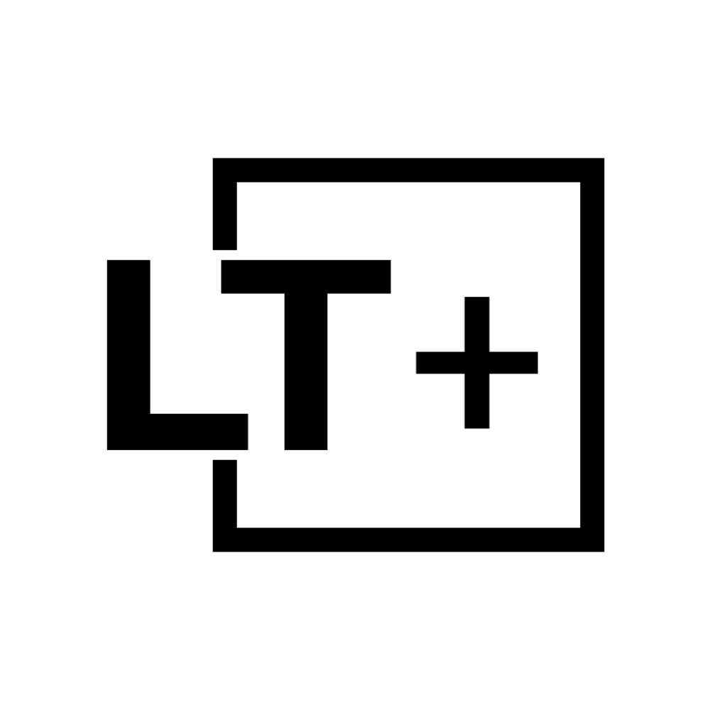

<p align="center">
  
</p>

<h1 align="center">IFC Playground</h1>

<p align="center">
  <strong>Interactive IFC file processing with Python scripts via IfcOpenShell WASM</strong>
</p>

<p align="center">

  <a href="https://github.com/louistrue/ifc-playground/blob/main/LICENSE">
    
  </a>
  <a href="https://nextjs.org/">
    
  </a>
  <a href="https://docs.ifcopenshell.org/">
    
  </a>
  <a href="https://threejs.org/">
    
  </a>
  <a href="https://www.typescriptlang.org/">
    
  </a>
</p>

<p align="center">
  <a href="https://playground.lt.plus">✨ Try the live demo at playground.lt.plus ✨</a>
</p>

## 🏢 About

IFC Playground is a web-based POC for processing and visualizing Industry Foundation Classes (IFC) files, commonly used in Building Information Modeling (BIM). It showcases interactive manipulation and analysis of architectural and construction data through a modern browser interface.

### 🔧 Key Features

- Interactive IFC file processing with Python
- WebAssembly implementation of IfcOpenShell for browser-based processing
- 3D visualization of IFC models using three.js
- Integrated Python code editor
- Built-in scripts for some sample IFC analysis tasks
- Modern, responsive UI with dark mode support

## 🚀 Getting Started

You can try the application directly at [playground.lt.plus](https://playground.lt.plus) without any installation.

To run the development server locally:

```bash
npm run dev
# or
yarn dev
# or
pnpm dev
# or
bun dev
```

Open [http://localhost:3000](http://localhost:3000) with your browser to see the result.

## 🛠️ Tech Stack

- **[Next.js](https://nextjs.org/)** - React framework for production
- **[IfcOpenShell WASM](https://github.com/IfcOpenShell/wasm-wheels)** - WebAssembly implementation of IfcOpenShell
- **[ThatOpen Engine](https://github.com/ThatOpen/engine_web-ifc)** - Web-based IFC parsing and rendering engine
- **[Three.js](https://threejs.org/)** - 3D visualization library
- **[TypeScript](https://www.typescriptlang.org/)** - Type-safe JavaScript

## 📚 Learn More

To learn more about the technologies used in this project:

- [Next.js Documentation](https://nextjs.org/docs) - learn about Next.js features and API
- [IfcOpenShell Documentation](https://docs.ifcopenshell.org/) - learn about IFC processing with IfcOpenShell
- [Three.js Documentation](https://threejs.org/docs/) - learn about 3D rendering with Three.js
- [IFC Format](https://technical.buildingsmart.org/standards/ifc/) - learn about the IFC standard

## 📝 License

This project is licensed under the GNU Affero General Public License v3.0 (AGPL-3.0) - see the LICENSE file for details.

The AGPL license ensures that:

- You can use, modify, and distribute this software
- If you modify and share this software, you must share your modifications under the same license
- If you run a modified version of this software as a service, you must make your modified version available to users

## 💖 Created By

This project is created with passion by [lt.plus](https://www.lt.plus/).

## 🚀 Deploy on Vercel

The easiest way to deploy your Next.js app is to use the [Vercel Platform](https://vercel.com/new?utm_medium=default-template&filter=next.js&utm_source=create-next-app&utm_campaign=create-next-app-readme) from the creators of Next.js.

Check out the [Next.js deployment documentation](https://nextjs.org/docs/app/building-your-application/deploying) for more details.
